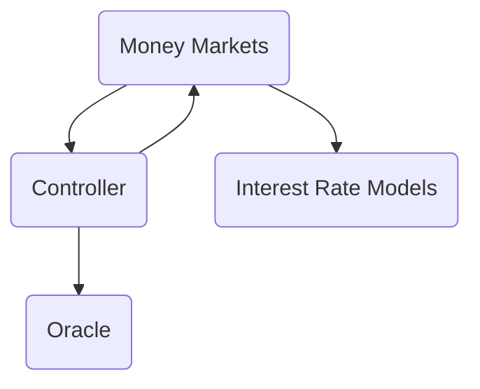

# Hatom Lending Protocol

Hatom Lending Protocol is a decentralized lending protocol, built on the [MultiversX](https://multiversx.com/) Blockchain. It
is a complete Money Market ecosystem that allows users to lend, borrow and stake their crypto assets at competitive interest
rates. Hatom is one of the most exciting projects in the DeFi space right now. Depositors earn a passive income by providing
liquidity to the market, while borrowers can borrow in an over-collateralized manner. Hatom was created to make lending on
the highly sought-after MultiversX Blockchain accessible.

## 🎉 Getting Started

This repository contains the source code for the Hatom Lending Protocol. The protocol is built on top of the
MultiversX blockchain and utilizes smart contracts to automate all processes. The smart contracts are written and tested in
Rust.

To compile the project, make sure you have installed [Rust](https://www.rust-lang.org/tools/install). After downloading the
repository and checking out the intended branch, you can build the project by simply running:

```bash
$ cargo build
```

## ✨ Protocol Overview

The lending protocol is composed of a series of smart contracts, namely:

-   **Money market**: solves the money market equations that allow tracking the interest being accrued by lenders and
    borrowers.
-   **Controller**: verifies if a user interaction with the protocol can or cannot be executed.
-   **Interest Rate Model**: computes the borrow and supply interest rates based on a mathematical model.
-   **Oracle**: in charge of providing accurate asset prices in a given numeraire.

Their connections can be better illustrated by the following simple diagram:



There is one Money Market per asset or underlying, such as `EGLD`, `SEGLD`, `USDC`, etc. Each money market is associated to
an Interest Rate Model. All Money Markets are related through the Controller. The Controller is able to translate amounts
into the same numeraire via the Oracle.

## 👥 Users

_Lenders_ or _suppliers_ interact with the protocol by providing underlying to any Money Market in order to get yield coming
from the interest paid by borrowers. The action of depositing underlying to a Money Market is commonly known as `minting`
given that it implies the `mint` of an interest bearing token known as the H-Token. There is one H-Token per money market,
such as `HEGLD`, `HSEGLD`, `HUSDC`, etc. The H-Tokens can be thought as representing shares on the pool. Users can redeem
their interest-bearing tokens at any time for the underlying and accrued interest.

A lender might become a _borrower_ by providing H-Tokens as collateral (i.e. depositing them in the Controller) and later
borrowing underlying from any Money Market.

Finally, _liquidators_ are agents that are constantly monitoring borrowers positions to identify if they become risky. When
an account becomes risky, it becomes eligible to be liquidated. A liquidation consists on the liquidator repaying a portion
of the borrower's borrow and getting borrower's collateral at a discount.

## 🔍 Audits

The Hatom Lending Protocol has been extensively audited before its launch. Multiple firms and parties have looked and
analyzed the code, including:

-   Various Hatom Core Developers
-   [MultiversX](https://multiversx.com/)
-   [Runtime Verification](https://runtimeverification.com/)
-   [Certik](https://www.certik.com/)
-   [Hacken](https://hacken.io/)
-   [Halborn](https://www.halborn.com/)
-   [Arda](https://arda.run/)
-   [ABDK](https://abdk.consulting/)
-   [Peckshield](https://peckshield.com/)

## 🛰️ Interactions

The main interactions that users can perform with the protocol are:

**Money Market Operations:**

-   **mint**: Supply underlying assets to a Money Market and receive H-Tokens in exchange (e.g., supply USDC and receive HUSDC).
-   **redeem**: Convert H-Tokens back to underlying assets plus accrued interest.
-   **borrow**: Borrow underlying assets from a Money Market using H-Tokens as collateral.
-   **repayBorrow**: Repay borrowed amounts to reduce debt.
-   **liquidate**: Liquidate undercollateralized positions by repaying borrower's debt in exchange for collateral at a discount.

**Controller Operations:**

-   **enterMarkets**: Enable H-Tokens as collateral for borrowing.
-   **exitMarket**: Disable H-Tokens as collateral (if allowed by risk parameters).

**Oracle Operations:**

-   **updatePrices**: Update asset price feeds (typically performed by authorized price feeders).

All interactions with the protocol are performed through smart contract calls using the MultiversX blockchain infrastructure.

## 📝 Documentation

-   [Developer documentation](https://docs.hatom.com/hatom/welcome-to-hatom-protocol/introduction)

## 🤝 Connect with the community

-   [Web](https://hatom.com/)
-   [App](https://app.hatom.com/lend)
-   [Discord](https://discord.com/invite/g9xf4axRPD)
-   [Blog](https://mirror.xyz/0xDac8B6141d28C46765255607f3572c73A064383f)
-   [Twitter](https://twitter.com/HatomProtocol)
-   [Telegram](https://t.me/+tfGNdvZpgcoxNDM0)
